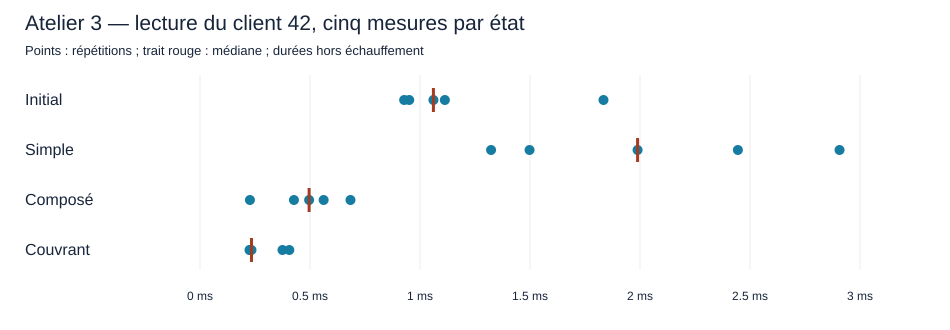

# Atelier 3 — L’historique client

Source : diapositive 12 de `J02_Indexer_modeliser.pptx`, exemples des diapositives 7 à 10. Base `shopflow` ; version PostgreSQL à reconfirmer si l’environnement a changé.

## Besoin et protocole

Comparer la base initiale, un index simple sur `client_id`, un index composé `(client_id, created_at DESC, id DESC)` et sa variante couvrante `INCLUDE (statut, total)`. Conserver les index des contraintes initiales ; tester un seul index expérimental à la fois. Contrôler l’inventaire avant toute suppression. Requête retenue, adaptée à l’exemple d’historique limité du cours :

```sql
SELECT id, created_at, statut, total
FROM shopflow.commandes
WHERE client_id = 42
ORDER BY created_at DESC, id DESC
LIMIT 20;
```

Clients retenus : 1, 42 et 999. Leurs effectifs ont été contrôlés : chacun possède 100 commandes. Le jeu initial distribue uniformément les commandes ; ces clients ne représentent pas à eux seuls une distribution déséquilibrée. Pour chaque état et chaque client : contrôle de contenu, une exécution d’échauffement puis cinq mesures `EXPLAIN (ANALYZE, BUFFERS)`. Relever plans complets, buffers, `Heap Fetches`, tailles des index et statistiques de durées. Les mesures de l’atelier 1 sans LIMIT ne constituent pas la référence de cette nouvelle requête. Comparer également un même lot d’insertion dans une transaction de laboratoire terminée par `ROLLBACK`, pour chaque état, avec échauffement et cinq mesures. Le retour arrière préserve le contenu logique mais n’annule pas tous les effets physiques (WAL, cache, tuples morts) ; documenter le protocole et éviter de comparer une série d’écritures avant les lectures suivantes sans tenir compte de la visibilité.

## Environnement et exactitude

Inventaire réel des index de `shopflow.commandes`, communiqué depuis pgAdmin :

```sql
CREATE UNIQUE INDEX commandes_client_id_cle_idempotence_key
ON shopflow.commandes USING btree (client_id, cle_idempotence);

CREATE UNIQUE INDEX commandes_pkey
ON shopflow.commandes USING btree (id);
```

Ces deux index correspondent aux contraintes initiales et doivent être conservés dans les quatre états. Aucun index expérimental n’est présent au contrôle initial. L’index unique commence déjà par `client_id` ; un nouvel index simple peut donc recouvrir une partie de son usage. Le gain éventuel devra être démontré par les plans, les mesures et les tailles. Contrôle initial des clients :

```sql
SELECT client_id,
       count(*) AS nombre_commandes,
       sum(total) AS montant_total
FROM shopflow.commandes
WHERE client_id IN (1, 42, 999)
GROUP BY client_id
ORDER BY client_id;
```

| Client | Nombre de commandes observé | Montant total observé |
|---|---:|---:|
| 1 | 100 | 17 250,00 |
| 42 | 100 | 47 760,00 |
| 999 | 100 | 25 621,25 |

Ces montants portent sur toutes les commandes de chaque client, et non sur les 20 lignes de l’historique limité. Le contenu initial avec `LIMIT 20` a été communiqué pour le client 42 : **20 lignes**, toutes au statut `payee`, chacune de montant **720,00**, soit **14 400,00** au total. Les identifiants vont de 86042 à 29042, par pas de −3000 dans l’ordre retourné ; les dates vont du 12 septembre 2026 à 23:54:02 UTC au même jour à 08:04:02 UTC, par pas de −50 minutes. La transcription complète et ordonnée est conservée dans [le CSV de référence](preuves/atelier3_reference_client42.csv). La référence du client 1 est également recueillie (voir ci-dessous). La référence du client 999 est également recueillie (voir ci-dessous). Après la collecte de l’état initial, l’étudiant a exécuté :

```sql
CREATE INDEX idx_atelier3_client_simple
ON shopflow.commandes (client_id);
```

Création annoncée avec succès par pgAdmin en **215 ms**. Cette durée est celle affichée par l’interface pour le DDL ; elle n’est pas une mesure `Execution Time` de lecture ou d’insertion. L’état testé suivant ajoute cet index simple aux deux index de contraintes initiaux. Sa définition et sa taille ont été vérifiées dans pg_indexes : index B-tree sur client_id, 704 512 octets (688 kB). Aucun autre index expérimental n’est présent.

## Tailles des index — état initial

| Index | Taille en octets | Taille lisible PostgreSQL |
|---|---:|---|
| commandes_client_id_cle_idempotence_key | 1 908 736 | 1864 kB |
| commandes_pkey | 4 513 792 | 4408 kB |

Total initial des deux index de `commandes` : **6 422 528 octets**. Tailles observées avant les tests d’insertion. Les contraintes et leurs index sont conservés pour les variantes suivantes.

## Contrôle après les insertions annulées — état initial

```sql
SELECT count(*) AS nombre_commandes,
       max(id) AS id_maximum,
       sum(total) AS montant_global
FROM shopflow.commandes;
```

Résultat communiqué après les lots d’insertion : **100 000 commandes**, **id maximal 100 000**, **montant global 29 775 001,25**. Ces trois valeurs correspondent à l’état initial. Ce contrôle valide les invariants relevés après les annulations, sans constituer une comparaison exhaustive ligne par ligne. Les effets physiques des insertions annulées restent possibles.

## Tableau de décision — lectures mesurées

| État | Client | p50 ms | p95 empirique ms | Buffers hit | Taille de l’index expérimental |
|---|---:|---:|---:|---:|---|
| Initial | 42 | 1,061 | 1,834 | 90 | Aucun |
| Initial | 1 | 1,656 | 2,336 | 99 | Aucun |
| Initial | 999 | 1,571 | 2,264 | 97 | Aucun |
| Simple | 42 | 1,989 | 2,907 | 90 | 688 kB |
| Simple | 1 | 1,785 | 2,050 | 99 | 688 kB |
| Simple | 999 | 1,707 | 1,886 | 97 | 688 kB |
| Composé | 42 | 0,496 | 0,684 | 23 | 3984 kB |
| Couvrant | 42 | 0,234 | 0,406 | 4 | 5792 kB |

## Insertions mesurées — lot de 1 000 commandes

| État | Répétitions | Moyenne ms | p50 ms | p95 empirique ms |
|---|---:|---:|---:|---:|
| Initial | 5 | 26,868 | 20,052 | 53,759 |
| Simple | 5 | 22,372 | 22,712 | 26,996 |

## Décision fondée sur les lectures du client 42

L’index couvrant donne la meilleure lecture observée : médiane de 0,234 ms, quatre accès aux blocs en cache et zéro Heap Fetch dans les cinq plans. Il occupe 5792 kB. L’index composé supprime aussi le tri et donne une médiane de 0,496 ms, pour 3984 kB. L’index simple conserve la récupération de 100 commandes avant tri et les mêmes buffers que l’état initial. Les résultats des 20 commandes du client 42 sont identiques dans les quatre états. Cette comparaison porte sur l’historique limité à 20 commandes du client 42 ; les tableaux d’insertion portent sur les états initial et simple.

[Mesures brutes](preuves/atelier3_mesures.csv), [statistiques](preuves/atelier3_synthese.csv), [tailles des index](preuves/atelier3_tailles_index.csv) et [graphique](preuves/atelier3_graphique.svg).



## Mesures de lecture — état initial, client 42

| Échauffement (exclu) | Mesure 1 | Mesure 2 | Mesure 3 | Mesure 4 | Mesure 5 |
|---|---|---|---|---|---|

### Échauffement — état initial, client 42

```sql
EXPLAIN (ANALYZE, BUFFERS)
SELECT id, created_at, statut, total
FROM shopflow.commandes
WHERE client_id = 42
ORDER BY created_at DESC, id DESC
LIMIT 20;
```

```text
Limit  (cost=329.84..329.89 rows=20 width=28) (actual time=1.617..1.627 rows=20.00 loops=1)
  Buffers: shared hit=90
  ->  Sort  (cost=329.84..330.09 rows=100 width=28) (actual time=1.612..1.614 rows=20.00 loops=1)
        Sort Key: created_at DESC, id DESC
        Sort Method: top-N heapsort  Memory: 27kB
        Buffers: shared hit=90
        ->  Bitmap Heap Scan on commandes  (cost=5.07..327.18 rows=100 width=28) (actual time=0.446..1.449 rows=100.00 loops=1)
              Recheck Cond: (client_id = 42)
              Heap Blocks: exact=88
              Buffers: shared hit=90
              ->  Bitmap Index Scan on commandes_client_id_cle_idempotence_key  (cost=0.00..5.04 rows=100 width=0) (actual time=0.365..0.366 rows=100.00 loops=1)
                    Index Cond: (client_id = 42)
                    Index Searches: 1
                    Buffers: shared hit=2
Planning Time: 0.763 ms
Execution Time: 1.872 ms
```

Le plan utilise l’index unique initial pour trouver 100 commandes, visite 88 blocs de table distincts et trie ces commandes en `top-N heapsort` (27 kB) pour retourner 20 lignes. Le nœud racine rapporte 90 accès aux blocs en cache, dont 2 pour l’index ; les compteurs parents incluent ceux des enfants. Aucun `shared read` n’est rapporté. Cet échauffement est exclu des cinq mesures.

### Mesure 1 — état initial, client 42

SQL : identique au bloc de l’échauffement ci-dessus.

```text
Limit  (cost=329.84..329.89 rows=20 width=28) (actual time=1.669..1.683 rows=20.00 loops=1)
  Buffers: shared hit=90
  ->  Sort  (cost=329.84..330.09 rows=100 width=28) (actual time=1.664..1.670 rows=20.00 loops=1)
        Sort Key: created_at DESC, id DESC
        Sort Method: top-N heapsort  Memory: 27kB
        Buffers: shared hit=90
        ->  Bitmap Heap Scan on commandes  (cost=5.07..327.18 rows=100 width=28) (actual time=0.229..1.525 rows=100.00 loops=1)
              Recheck Cond: (client_id = 42)
              Heap Blocks: exact=88
              Buffers: shared hit=90
              ->  Bitmap Index Scan on commandes_client_id_cle_idempotence_key  (cost=0.00..5.04 rows=100 width=0) (actual time=0.154..0.158 rows=100.00 loops=1)
                    Index Cond: (client_id = 42)
                    Index Searches: 1
                    Buffers: shared hit=2
Planning Time: 0.591 ms
Execution Time: 1.834 ms
```

### Mesure 2 — état initial, client 42

SQL : identique au bloc de l’échauffement ci-dessus.

```text
Limit  (cost=329.84..329.89 rows=20 width=28) (actual time=0.883..0.890 rows=20.00 loops=1)
  Buffers: shared hit=90
  ->  Sort  (cost=329.84..330.09 rows=100 width=28) (actual time=0.883..0.884 rows=20.00 loops=1)
        Sort Key: created_at DESC, id DESC
        Sort Method: top-N heapsort  Memory: 27kB
        Buffers: shared hit=90
        ->  Bitmap Heap Scan on commandes  (cost=5.07..327.18 rows=100 width=28) (actual time=0.168..0.790 rows=100.00 loops=1)
              Recheck Cond: (client_id = 42)
              Heap Blocks: exact=88
              Buffers: shared hit=90
              ->  Bitmap Index Scan on commandes_client_id_cle_idempotence_key  (cost=0.00..5.04 rows=100 width=0) (actual time=0.108..0.108 rows=100.00 loops=1)
                    Index Cond: (client_id = 42)
                    Index Searches: 1
                    Buffers: shared hit=2
Planning Time: 0.587 ms
Execution Time: 0.951 ms
```

### Mesure 3 — état initial, client 42

SQL : identique au bloc de l’échauffement ci-dessus.

```text
Limit  (cost=329.84..329.89 rows=20 width=28) (actual time=0.984..0.990 rows=20.00 loops=1)
  Buffers: shared hit=90
  ->  Sort  (cost=329.84..330.09 rows=100 width=28) (actual time=0.984..0.985 rows=20.00 loops=1)
        Sort Key: created_at DESC, id DESC
        Sort Method: top-N heapsort  Memory: 27kB
        Buffers: shared hit=90
        ->  Bitmap Heap Scan on commandes  (cost=5.07..327.18 rows=100 width=28) (actual time=0.197..0.906 rows=100.00 loops=1)
              Recheck Cond: (client_id = 42)
              Heap Blocks: exact=88
              Buffers: shared hit=90
              ->  Bitmap Index Scan on commandes_client_id_cle_idempotence_key  (cost=0.00..5.04 rows=100 width=0) (actual time=0.130..0.130 rows=100.00 loops=1)
                    Index Cond: (client_id = 42)
                    Index Searches: 1
                    Buffers: shared hit=2
Planning Time: 0.726 ms
Execution Time: 1.113 ms
```

### Mesure 4 — état initial, client 42

SQL : identique au bloc de l’échauffement ci-dessus.

```text
Limit  (cost=329.84..329.89 rows=20 width=28) (actual time=0.985..0.991 rows=20.00 loops=1)
  Buffers: shared hit=90
  ->  Sort  (cost=329.84..330.09 rows=100 width=28) (actual time=0.984..0.986 rows=20.00 loops=1)
        Sort Key: created_at DESC, id DESC
        Sort Method: top-N heapsort  Memory: 27kB
        Buffers: shared hit=90
        ->  Bitmap Heap Scan on commandes  (cost=5.07..327.18 rows=100 width=28) (actual time=0.147..0.889 rows=100.00 loops=1)
              Recheck Cond: (client_id = 42)
              Heap Blocks: exact=88
              Buffers: shared hit=90
              ->  Bitmap Index Scan on commandes_client_id_cle_idempotence_key  (cost=0.00..5.04 rows=100 width=0) (actual time=0.089..0.090 rows=100.00 loops=1)
                    Index Cond: (client_id = 42)
                    Index Searches: 1
                    Buffers: shared hit=2
Planning Time: 0.237 ms
Execution Time: 1.061 ms
```

### Mesure 5 — état initial, client 42

SQL : identique au bloc de l’échauffement ci-dessus.

```text
Limit  (cost=329.84..329.89 rows=20 width=28) (actual time=0.801..0.807 rows=20.00 loops=1)
  Buffers: shared hit=90
  ->  Sort  (cost=329.84..330.09 rows=100 width=28) (actual time=0.799..0.800 rows=20.00 loops=1)
        Sort Key: created_at DESC, id DESC
        Sort Method: top-N heapsort  Memory: 27kB
        Buffers: shared hit=90
        ->  Bitmap Heap Scan on commandes  (cost=5.07..327.18 rows=100 width=28) (actual time=0.163..0.731 rows=100.00 loops=1)
              Recheck Cond: (client_id = 42)
              Heap Blocks: exact=88
              Buffers: shared hit=90
              ->  Bitmap Index Scan on commandes_client_id_cle_idempotence_key  (cost=0.00..5.04 rows=100 width=0) (actual time=0.097..0.097 rows=100.00 loops=1)
                    Index Cond: (client_id = 42)
                    Index Searches: 1
                    Buffers: shared hit=2
Planning Time: 0.234 ms
Execution Time: 0.928 ms
```

Synthèse initiale, client 42 : moyenne **1,177 ms**, p50 **1,061 ms**, p95 empirique **1,834 ms**, minimum **0,928 ms**, maximum **1,834 ms**. Les cinq plans récupèrent 100 commandes, puis retournent 20 lignes après tri top-N en mémoire (27 kB) ; 90 accès aux blocs en cache et 88 blocs de table distincts à chaque mesure. Le p95 utilise le rang ceil(0,95 × 5), donc le maximum de ce petit échantillon.

## Référence de contenu — client 1, état initial

Résultat communiqué : **20 lignes**, toutes au statut `annulee`, chacune de montant **86,25**, soit **1 725,00** au total. Les identifiants vont de 86001 à 29001, par pas de −3000 dans l’ordre retourné. Les dates vont du 26 août 2026 à 23:53:21 UTC au même jour à 08:03:21 UTC, par pas de −50 minutes. La transcription complète et ordonnée figure dans [le CSV de référence du client 1](preuves/atelier3_reference_client1.csv).

## Mesures de lecture — état initial, client 1

```sql
EXPLAIN (ANALYZE, BUFFERS)
SELECT id, created_at, statut, total
FROM shopflow.commandes
WHERE client_id = 1
ORDER BY created_at DESC, id DESC
LIMIT 20;
```

| Échauffement (exclu) | Mesure 1 | Mesure 2 | Mesure 3 | Mesure 4 | Mesure 5 |
|---|---|---|---|---|---|
| 5,290 ms | 2,160 ms | 1,656 ms | 1,211 ms | 2,336 ms | 1,654 ms |

### Échauffement — état initial, client 1

SQL : identique au bloc du client 1 ci-dessus.

```text
Limit  (cost=329.84..329.89 rows=20 width=28) (actual time=5.122..5.136 rows=20.00 loops=1)
  Buffers: shared hit=99
  ->  Sort  (cost=329.84..330.09 rows=100 width=28) (actual time=5.117..5.124 rows=20.00 loops=1)
        Sort Key: created_at DESC, id DESC
        Sort Method: top-N heapsort  Memory: 27kB
        Buffers: shared hit=99
        ->  Bitmap Heap Scan on commandes  (cost=5.07..327.18 rows=100 width=28) (actual time=0.192..4.977 rows=100.00 loops=1)
              Recheck Cond: (client_id = 1)
              Heap Blocks: exact=97
              Buffers: shared hit=99
              ->  Bitmap Index Scan on commandes_client_id_cle_idempotence_key  (cost=0.00..5.04 rows=100 width=0) (actual time=0.127..0.130 rows=100.00 loops=1)
                    Index Cond: (client_id = 1)
                    Index Searches: 1
                    Buffers: shared hit=2
Planning Time: 0.556 ms
Execution Time: 5.290 ms
```

Cet échauffement est exclu des cinq mesures. Le plan récupère 100 commandes réparties sur 97 blocs de table distincts, puis retourne 20 lignes après tri top-N en mémoire (27 kB). Le nœud racine rapporte 99 accès aux blocs en cache, dont 2 pour l’index. Aucun `shared read` n’est rapporté. La cause du temps plus élevé que celui de l’échauffement du client 42 ne peut pas être établie à partir de ce seul plan.

### Mesure 1 — état initial, client 1

SQL : identique au bloc du client 1 ci-dessus.

```text
Limit  (cost=329.84..329.89 rows=20 width=28) (actual time=1.969..1.995 rows=20.00 loops=1)
  Buffers: shared hit=99
  ->  Sort  (cost=329.84..330.09 rows=100 width=28) (actual time=1.968..1.971 rows=20.00 loops=1)
        Sort Key: created_at DESC, id DESC
        Sort Method: top-N heapsort  Memory: 27kB
        Buffers: shared hit=99
        ->  Bitmap Heap Scan on commandes  (cost=5.07..327.18 rows=100 width=28) (actual time=0.211..1.755 rows=100.00 loops=1)
              Recheck Cond: (client_id = 1)
              Heap Blocks: exact=97
              Buffers: shared hit=99
              ->  Bitmap Index Scan on commandes_client_id_cle_idempotence_key  (cost=0.00..5.04 rows=100 width=0) (actual time=0.138..0.139 rows=100.00 loops=1)
                    Index Cond: (client_id = 1)
                    Index Searches: 1
                    Buffers: shared hit=2
Planning Time: 1.270 ms
Execution Time: 2.160 ms
```

### Mesure 2 — état initial, client 1

SQL : identique au bloc du client 1 ci-dessus.

```text
Limit  (cost=329.84..329.89 rows=20 width=28) (actual time=1.557..1.569 rows=20.00 loops=1)
  Buffers: shared hit=99
  ->  Sort  (cost=329.84..330.09 rows=100 width=28) (actual time=1.554..1.563 rows=20.00 loops=1)
        Sort Key: created_at DESC, id DESC
        Sort Method: top-N heapsort  Memory: 27kB
        Buffers: shared hit=99
        ->  Bitmap Heap Scan on commandes  (cost=5.07..327.18 rows=100 width=28) (actual time=0.146..1.408 rows=100.00 loops=1)
              Recheck Cond: (client_id = 1)
              Heap Blocks: exact=97
              Buffers: shared hit=99
              ->  Bitmap Index Scan on commandes_client_id_cle_idempotence_key  (cost=0.00..5.04 rows=100 width=0) (actual time=0.079..0.079 rows=100.00 loops=1)
                    Index Cond: (client_id = 1)
                    Index Searches: 1
                    Buffers: shared hit=2
Planning Time: 0.258 ms
Execution Time: 1.656 ms
```

### Mesure 3 — état initial, client 1

SQL : identique au bloc du client 1 ci-dessus.

```text
Limit  (cost=329.84..329.89 rows=20 width=28) (actual time=1.105..1.117 rows=20.00 loops=1)
  Buffers: shared hit=99
  ->  Sort  (cost=329.84..330.09 rows=100 width=28) (actual time=1.101..1.106 rows=20.00 loops=1)
        Sort Key: created_at DESC, id DESC
        Sort Method: top-N heapsort  Memory: 27kB
        Buffers: shared hit=99
        ->  Bitmap Heap Scan on commandes  (cost=5.07..327.18 rows=100 width=28) (actual time=0.136..1.018 rows=100.00 loops=1)
              Recheck Cond: (client_id = 1)
              Heap Blocks: exact=97
              Buffers: shared hit=99
              ->  Bitmap Index Scan on commandes_client_id_cle_idempotence_key  (cost=0.00..5.04 rows=100 width=0) (actual time=0.094..0.094 rows=100.00 loops=1)
                    Index Cond: (client_id = 1)
                    Index Searches: 1
                    Buffers: shared hit=2
Planning Time: 0.408 ms
Execution Time: 1.211 ms
```

### Mesure 4 — état initial, client 1

SQL : identique au bloc du client 1 ci-dessus.

```text
Limit  (cost=329.84..329.89 rows=20 width=28) (actual time=2.160..2.180 rows=20.00 loops=1)
  Buffers: shared hit=99
  ->  Sort  (cost=329.84..330.09 rows=100 width=28) (actual time=2.154..2.163 rows=20.00 loops=1)
        Sort Key: created_at DESC, id DESC
        Sort Method: top-N heapsort  Memory: 27kB
        Buffers: shared hit=99
        ->  Bitmap Heap Scan on commandes  (cost=5.07..327.18 rows=100 width=28) (actual time=0.328..1.974 rows=100.00 loops=1)
              Recheck Cond: (client_id = 1)
              Heap Blocks: exact=97
              Buffers: shared hit=99
              ->  Bitmap Index Scan on commandes_client_id_cle_idempotence_key  (cost=0.00..5.04 rows=100 width=0) (actual time=0.225..0.225 rows=100.00 loops=1)
                    Index Cond: (client_id = 1)
                    Index Searches: 1
                    Buffers: shared hit=2
Planning Time: 0.854 ms
Execution Time: 2.336 ms
```

### Mesure 5 — état initial, client 1

SQL : identique au bloc du client 1 ci-dessus.

```text
Limit  (cost=329.84..329.89 rows=20 width=28) (actual time=1.515..1.524 rows=20.00 loops=1)
  Buffers: shared hit=99
  ->  Sort  (cost=329.84..330.09 rows=100 width=28) (actual time=1.514..1.516 rows=20.00 loops=1)
        Sort Key: created_at DESC, id DESC
        Sort Method: top-N heapsort  Memory: 27kB
        Buffers: shared hit=99
        ->  Bitmap Heap Scan on commandes  (cost=5.07..327.18 rows=100 width=28) (actual time=0.220..1.407 rows=100.00 loops=1)
              Recheck Cond: (client_id = 1)
              Heap Blocks: exact=97
              Buffers: shared hit=99
              ->  Bitmap Index Scan on commandes_client_id_cle_idempotence_key  (cost=0.00..5.04 rows=100 width=0) (actual time=0.129..0.129 rows=100.00 loops=1)
                    Index Cond: (client_id = 1)
                    Index Searches: 1
                    Buffers: shared hit=2
Planning Time: 0.998 ms
Execution Time: 1.654 ms
```

Synthèse initiale, client 1 : moyenne **1,803 ms**, p50 **1,656 ms**, p95 empirique **2,336 ms**, minimum **1,211 ms**, maximum **2,336 ms**. Les cinq plans récupèrent 100 commandes puis retournent 20 lignes après tri top-N en mémoire (27 kB). Chaque plan rapporte 99 accès aux blocs en cache et 97 blocs de table distincts. Le p95 empirique correspond au maximum sur cinq mesures ; l’échauffement est exclu.

## Référence de contenu — client 999, état initial

Résultat communiqué : **20 lignes**, toutes au statut `payee`, chacune de montant **386,25**, soit **7 725,00** au total. Les identifiants vont de 83999 à 26999 par pas de −3000, dans l’ordre retourné. Les dates vont du 21 septembre 2026 à 23:19:59 UTC au même jour à 07:29:59 UTC, par pas de −50 minutes. La transcription complète et ordonnée est conservée dans [le CSV de référence du client 999](preuves/atelier3_reference_client999.csv).

## Mesures de lecture — état initial, client 999

```sql
EXPLAIN (ANALYZE, BUFFERS)
SELECT id, created_at, statut, total
FROM shopflow.commandes
WHERE client_id = 999
ORDER BY created_at DESC, id DESC
LIMIT 20;
```

| Échauffement (exclu) | Mesure 1 | Mesure 2 | Mesure 3 | Mesure 4 | Mesure 5 |
|---|---|---|---|---|---|
| 2,364 ms | 1,309 ms | 1,693 ms | 1,220 ms | 2,264 ms | 1,571 ms |

### Échauffement — état initial, client 999

SQL : identique au bloc du client 999 ci-dessus.

```text
Limit  (cost=329.84..329.89 rows=20 width=28) (actual time=2.061..2.073 rows=20.00 loops=1)
  Buffers: shared hit=97
  ->  Sort  (cost=329.84..330.09 rows=100 width=28) (actual time=2.060..2.062 rows=20.00 loops=1)
        Sort Key: created_at DESC, id DESC
        Sort Method: top-N heapsort  Memory: 27kB
        Buffers: shared hit=97
        ->  Bitmap Heap Scan on commandes  (cost=5.07..327.18 rows=100 width=28) (actual time=0.613..1.869 rows=100.00 loops=1)
              Recheck Cond: (client_id = 999)
              Heap Blocks: exact=95
              Buffers: shared hit=97
              ->  Bitmap Index Scan on commandes_client_id_cle_idempotence_key  (cost=0.00..5.04 rows=100 width=0) (actual time=0.436..0.436 rows=100.00 loops=1)
                    Index Cond: (client_id = 999)
                    Index Searches: 1
                    Buffers: shared hit=2
Planning Time: 0.947 ms
Execution Time: 2.364 ms
```

Cet échauffement est exclu des cinq mesures. Le plan récupère 100 commandes réparties sur 95 blocs de table distincts, puis retourne 20 lignes après tri top-N en mémoire (27 kB). Le nœud racine rapporte 97 accès aux blocs en cache, dont 2 pour l’index. Aucun `shared read` n’est rapporté.

### Mesure 1 — état initial, client 999

SQL : identique au bloc du client 999 ci-dessus.

```text
Limit  (cost=329.84..329.89 rows=20 width=28) (actual time=1.199..1.206 rows=20.00 loops=1)
  Buffers: shared hit=97
  ->  Sort  (cost=329.84..330.09 rows=100 width=28) (actual time=1.198..1.200 rows=20.00 loops=1)
        Sort Key: created_at DESC, id DESC
        Sort Method: top-N heapsort  Memory: 27kB
        Buffers: shared hit=97
        ->  Bitmap Heap Scan on commandes  (cost=5.07..327.18 rows=100 width=28) (actual time=0.197..1.107 rows=100.00 loops=1)
              Recheck Cond: (client_id = 999)
              Heap Blocks: exact=95
              Buffers: shared hit=97
              ->  Bitmap Index Scan on commandes_client_id_cle_idempotence_key  (cost=0.00..5.04 rows=100 width=0) (actual time=0.120..0.120 rows=100.00 loops=1)
                    Index Cond: (client_id = 999)
                    Index Searches: 1
                    Buffers: shared hit=2
Planning Time: 0.501 ms
Execution Time: 1.309 ms
```

### Mesure 2 — état initial, client 999

SQL : identique au bloc du client 999 ci-dessus.

```text
Limit  (cost=329.84..329.89 rows=20 width=28) (actual time=1.544..1.556 rows=20.00 loops=1)
  Buffers: shared hit=97
  ->  Sort  (cost=329.84..330.09 rows=100 width=28) (actual time=1.540..1.544 rows=20.00 loops=1)
        Sort Key: created_at DESC, id DESC
        Sort Method: top-N heapsort  Memory: 27kB
        Buffers: shared hit=97
        ->  Bitmap Heap Scan on commandes  (cost=5.07..327.18 rows=100 width=28) (actual time=0.245..1.437 rows=100.00 loops=1)
              Recheck Cond: (client_id = 999)
              Heap Blocks: exact=95
              Buffers: shared hit=97
              ->  Bitmap Index Scan on commandes_client_id_cle_idempotence_key  (cost=0.00..5.04 rows=100 width=0) (actual time=0.153..0.156 rows=100.00 loops=1)
                    Index Cond: (client_id = 999)
                    Index Searches: 1
                    Buffers: shared hit=2
Planning Time: 0.540 ms
Execution Time: 1.693 ms
```

### Mesure 3 — état initial, client 999

SQL : identique au bloc du client 999 ci-dessus.

```text
Limit  (cost=329.84..329.89 rows=20 width=28) (actual time=1.125..1.135 rows=20.00 loops=1)
  Buffers: shared hit=97
  ->  Sort  (cost=329.84..330.09 rows=100 width=28) (actual time=1.124..1.128 rows=20.00 loops=1)
        Sort Key: created_at DESC, id DESC
        Sort Method: top-N heapsort  Memory: 27kB
        Buffers: shared hit=97
        ->  Bitmap Heap Scan on commandes  (cost=5.07..327.18 rows=100 width=28) (actual time=0.220..1.058 rows=100.00 loops=1)
              Recheck Cond: (client_id = 999)
              Heap Blocks: exact=95
              Buffers: shared hit=97
              ->  Bitmap Index Scan on commandes_client_id_cle_idempotence_key  (cost=0.00..5.04 rows=100 width=0) (actual time=0.139..0.139 rows=100.00 loops=1)
                    Index Cond: (client_id = 999)
                    Index Searches: 1
                    Buffers: shared hit=2
Planning Time: 0.466 ms
Execution Time: 1.220 ms
```

### Mesure 4 — état initial, client 999

SQL : identique au bloc du client 999 ci-dessus.

```text
Limit  (cost=329.84..329.89 rows=20 width=28) (actual time=2.106..2.119 rows=20.00 loops=1)
  Buffers: shared hit=97
  ->  Sort  (cost=329.84..330.09 rows=100 width=28) (actual time=2.102..2.104 rows=20.00 loops=1)
        Sort Key: created_at DESC, id DESC
        Sort Method: top-N heapsort  Memory: 27kB
        Buffers: shared hit=97
        ->  Bitmap Heap Scan on commandes  (cost=5.07..327.18 rows=100 width=28) (actual time=0.262..1.907 rows=100.00 loops=1)
              Recheck Cond: (client_id = 999)
              Heap Blocks: exact=95
              Buffers: shared hit=97
              ->  Bitmap Index Scan on commandes_client_id_cle_idempotence_key  (cost=0.00..5.04 rows=100 width=0) (actual time=0.163..0.163 rows=100.00 loops=1)
                    Index Cond: (client_id = 999)
                    Index Searches: 1
                    Buffers: shared hit=2
Planning Time: 0.601 ms
Execution Time: 2.264 ms
```

### Mesure 5 — état initial, client 999

SQL : identique au bloc du client 999 ci-dessus.

```text
Limit  (cost=329.84..329.89 rows=20 width=28) (actual time=1.522..1.528 rows=20.00 loops=1)
  Buffers: shared hit=97
  ->  Sort  (cost=329.84..330.09 rows=100 width=28) (actual time=1.520..1.523 rows=20.00 loops=1)
        Sort Key: created_at DESC, id DESC
        Sort Method: top-N heapsort  Memory: 27kB
        Buffers: shared hit=97
        ->  Bitmap Heap Scan on commandes  (cost=5.07..327.18 rows=100 width=28) (actual time=0.195..1.437 rows=100.00 loops=1)
              Recheck Cond: (client_id = 999)
              Heap Blocks: exact=95
              Buffers: shared hit=97
              ->  Bitmap Index Scan on commandes_client_id_cle_idempotence_key  (cost=0.00..5.04 rows=100 width=0) (actual time=0.150..0.150 rows=100.00 loops=1)
                    Index Cond: (client_id = 999)
                    Index Searches: 1
                    Buffers: shared hit=2
Planning Time: 0.267 ms
Execution Time: 1.571 ms
```

Synthèse initiale, client 999 : moyenne **1,611 ms**, p50 **1,571 ms**, p95 empirique **2,264 ms**, minimum **1,220 ms**, maximum **2,264 ms**. Les cinq plans rapportent 97 accès aux blocs en cache et 95 blocs de table distincts ; 100 commandes sont récupérées avant le tri top-N de 27 kB et la limitation à 20 lignes. Échauffement exclu.

## Insertion — protocole commun aux quatre états

Lot de 1 000 commandes synthétiques, réparties sur les clients 1, 42 et 999, sans lignes associées. Identifiants supérieurs au maximum courant, date fixe, statut `payee`, total 0 et clé d’idempotence NULL. Chaque exécution utilise une transaction terminée par `ROLLBACK`. Aucun autre écrivain ne doit intervenir pendant ces essais. Le lot mesure uniquement l’insertion dans `commandes`, pas un achat complet ni le commit durable. Une exécution d’échauffement, puis cinq mesures par état. Conserver chaque plan complet et `Execution Time`. Le calcul du maximum et la génération du lot sont inclus dans la mesure et restent identiques entre variantes. ROLLBACK restaure le contenu logique mais peut laisser des tuples morts, du WAL et des changements de cache ou de taille ; ces limites devront être prises en compte pour les comparaisons, notamment la visibilité de l’index couvrant.

```sql
BEGIN;

EXPLAIN (ANALYZE, BUFFERS)
INSERT INTO shopflow.commandes
  (id, client_id, created_at, statut, total)
SELECT b.max_id + g.n,
       CASE g.n % 3 WHEN 0 THEN 1 WHEN 1 THEN 42 ELSE 999 END,
       TIMESTAMPTZ '2026-10-05 12:00:00+00',
       'payee',
       0
FROM (SELECT max(id) AS max_id FROM shopflow.commandes) b
CROSS JOIN generate_series(1, 1000) AS g(n);

ROLLBACK;
```

État initial : un échauffement documenté et cinq mesures conservés. Les tailles initiales ont été relevées avant ce lot.

### Échauffement documenté — insertion, état initial

Une première exécution du bloc complet a été annoncée par pgAdmin en 179 ms, sans plan transmis. Cette durée porte sur le bloc complet et n’est pas utilisée comme mesure d’Execution Time. Une seconde exécution, avec BEGIN, EXPLAIN et ROLLBACK séparés, fournit l’échauffement documenté ci-dessous. L’étudiant a confirmé l’exécution du ROLLBACK de cette seconde exécution ; les insertions de ce lot n’ont pas été conservées. SQL : lot de 1 000 insertions décrit dans le protocole commun ci-dessus.

```text
Insert on commandes  (cost=0.46..32.97 rows=0 width=0) (actual time=27.347..27.354 rows=0.00 loops=1)
  Buffers: shared hit=5484 dirtied=8
  ->  Nested Loop  (cost=0.46..32.97 rows=1000 width=104) (actual time=1.326..2.044 rows=1000.00 loops=1)
        Buffers: shared hit=15
        ->  Result  (cost=0.45..0.46 rows=1 width=8) (actual time=1.159..1.161 rows=1.00 loops=1)
              Buffers: shared hit=15
              InitPlan 1
                ->  Limit  (cost=0.42..0.45 rows=1 width=8) (actual time=1.145..1.146 rows=1.00 loops=1)
                      Buffers: shared hit=15
                      ->  Index Only Scan Backward using commandes_pkey on commandes commandes_1  (cost=0.42..3712.42 rows=100000 width=8) (actual time=1.144..1.144 rows=1.00 loops=1)
                            Heap Fetches: 1000
                            Index Searches: 1
                            Buffers: shared hit=15
        ->  Function Scan on generate_series g  (cost=0.00..10.00 rows=1000 width=4) (actual time=0.147..0.311 rows=1000.00 loops=1)
Planning Time: 1.441 ms
Trigger for constraint commandes_client_id_fkey: time=6.030 calls=1000
Execution Time: 33.894 ms
```

Échauffement exclu des cinq mesures : **33,894 ms**. Le plan génère 1 000 lignes ; le nœud Insert affiche zéro ligne de sortie en l’absence de RETURNING. Il rapporte 5 484 accès aux blocs en cache et 8 blocs salis. Le contrôle de clé étrangère est appelé 1 000 fois (6,030 ms rapportées, incluses dans Execution Time). La recherche de max(id) rapporte 1 000 Heap Fetches, compatibles avec les tuples des insertions précédentes annulées ; cette cause est une hypothèse, non une vérification physique. Les répétitions avec ROLLBACK peuvent ainsi modifier le travail de recherche du maximum. Aucun nettoyage intermédiaire n’a été rapporté.

### Mesure 1 — insertion, état initial

SQL : identique au lot de 1 000 insertions du protocole commun, entre BEGIN et ROLLBACK. Résultat transmis après la consigne d’annulation du lot.

```text
Insert on commandes  (cost=0.46..32.97 rows=0 width=0) (actual time=48.282..48.318 rows=0.00 loops=1)
  Buffers: shared hit=5485 dirtied=28 written=1
  ->  Nested Loop  (cost=0.46..32.97 rows=1000 width=104) (actual time=6.718..7.617 rows=1000.00 loops=1)
        Buffers: shared hit=15 dirtied=11
        ->  Result  (cost=0.45..0.46 rows=1 width=8) (actual time=6.516..6.520 rows=1.00 loops=1)
              Buffers: shared hit=15 dirtied=11
              InitPlan 1
                ->  Limit  (cost=0.42..0.45 rows=1 width=8) (actual time=6.481..6.482 rows=1.00 loops=1)
                      Buffers: shared hit=15 dirtied=11
                      ->  Index Only Scan Backward using commandes_pkey on commandes commandes_1  (cost=0.42..3712.42 rows=100000 width=8) (actual time=6.476..6.476 rows=1.00 loops=1)
                            Heap Fetches: 1000
                            Index Searches: 1
                            Buffers: shared hit=15 dirtied=11
        ->  Function Scan on generate_series g  (cost=0.00..10.00 rows=1000 width=4) (actual time=0.168..0.378 rows=1000.00 loops=1)
Planning Time: 0.850 ms
Trigger for constraint commandes_client_id_fkey: time=5.044 calls=1000
Execution Time: 53.759 ms
```

Execution Time : **53,759 ms**. Le nœud Insert rapporte 5 485 accès aux blocs en cache, 28 blocs salis et 1 bloc écrit. Le calcul du maximum nécessite 1 000 Heap Fetches ; son travail est inclus dans cette mesure, ainsi que les contrôles de clé étrangère (1 000 appels, 5,044 ms rapportées). Les compteurs et temps parents incluent le travail des enfants et ne doivent pas être additionnés.

### Mesure 2 — insertion, état initial

SQL : identique au lot de 1 000 insertions du protocole commun, entre BEGIN et ROLLBACK.

```text
Insert on commandes  (cost=0.46..32.97 rows=0 width=0) (actual time=19.744..19.753 rows=0.00 loops=1)
  Buffers: shared hit=5465 dirtied=38 written=9
  ->  Nested Loop  (cost=0.46..32.97 rows=1000 width=104) (actual time=4.731..5.255 rows=1000.00 loops=1)
        Buffers: shared hit=15 dirtied=11
        ->  Result  (cost=0.45..0.46 rows=1 width=8) (actual time=4.586..4.588 rows=1.00 loops=1)
              Buffers: shared hit=15 dirtied=11
              InitPlan 1
                ->  Limit  (cost=0.42..0.45 rows=1 width=8) (actual time=4.580..4.581 rows=1.00 loops=1)
                      Buffers: shared hit=15 dirtied=11
                      ->  Index Only Scan Backward using commandes_pkey on commandes commandes_1  (cost=0.42..3712.42 rows=100000 width=8) (actual time=4.578..4.578 rows=1.00 loops=1)
                            Heap Fetches: 1000
                            Index Searches: 1
                            Buffers: shared hit=15 dirtied=11
        ->  Function Scan on generate_series g  (cost=0.00..10.00 rows=1000 width=4) (actual time=0.126..0.257 rows=1000.00 loops=1)
Planning Time: 0.949 ms
Trigger for constraint commandes_client_id_fkey: time=7.480 calls=1000
Execution Time: 27.691 ms
```

Execution Time : **27,691 ms**. Le nœud Insert rapporte 5 465 accès aux blocs en cache, 38 blocs salis et 9 blocs écrits. Le calcul du maximum rapporte toujours 1 000 Heap Fetches. Les contrôles de clé étrangère totalisent 1 000 appels et 7,480 ms, incluses dans Execution Time.

### Mesure 3 — insertion, état initial

SQL : identique au lot de 1 000 insertions du protocole commun, entre BEGIN et ROLLBACK.

```text
Insert on commandes  (cost=0.46..32.97 rows=0 width=0) (actual time=11.360..11.369 rows=0.00 loops=1)
  Buffers: shared hit=5481 dirtied=8
  ->  Nested Loop  (cost=0.46..32.97 rows=1000 width=104) (actual time=0.617..0.979 rows=1000.00 loops=1)
        Buffers: shared hit=15
        ->  Result  (cost=0.45..0.46 rows=1 width=8) (actual time=0.524..0.526 rows=1.00 loops=1)
              Buffers: shared hit=15
              InitPlan 1
                ->  Limit  (cost=0.42..0.45 rows=1 width=8) (actual time=0.521..0.522 rows=1.00 loops=1)
                      Buffers: shared hit=15
                      ->  Index Only Scan Backward using commandes_pkey on commandes commandes_1  (cost=0.42..3712.42 rows=100000 width=8) (actual time=0.520..0.520 rows=1.00 loops=1)
                            Heap Fetches: 1000
                            Index Searches: 1
                            Buffers: shared hit=15
        ->  Function Scan on generate_series g  (cost=0.00..10.00 rows=1000 width=4) (actual time=0.085..0.176 rows=1000.00 loops=1)
Planning Time: 0.626 ms
Trigger for constraint commandes_client_id_fkey: time=6.362 calls=1000
Execution Time: 18.113 ms
```

Execution Time : **18,113 ms**. Le nœud Insert rapporte 5 481 accès aux blocs en cache et 8 blocs salis. Les 1 000 contrôles de clé étrangère prennent 6,362 ms rapportées, incluses dans Execution Time. Le calcul du maximum conserve 1 000 Heap Fetches.

### Mesure 4 — insertion, état initial

SQL : identique au lot de 1 000 insertions du protocole commun, entre BEGIN et ROLLBACK.

```text
Insert on commandes  (cost=0.46..32.97 rows=0 width=0) (actual time=10.035..10.041 rows=0.00 loops=1)
  Buffers: shared hit=5489 dirtied=11 written=3
  ->  Nested Loop  (cost=0.46..32.97 rows=1000 width=104) (actual time=0.456..0.761 rows=1000.00 loops=1)
        Buffers: shared hit=15
        ->  Result  (cost=0.45..0.46 rows=1 width=8) (actual time=0.382..0.384 rows=1.00 loops=1)
              Buffers: shared hit=15
              InitPlan 1
                ->  Limit  (cost=0.42..0.45 rows=1 width=8) (actual time=0.380..0.381 rows=1.00 loops=1)
                      Buffers: shared hit=15
                      ->  Index Only Scan Backward using commandes_pkey on commandes commandes_1  (cost=0.42..3712.42 rows=100000 width=8) (actual time=0.380..0.380 rows=1.00 loops=1)
                            Heap Fetches: 1000
                            Index Searches: 1
                            Buffers: shared hit=15
        ->  Function Scan on generate_series g  (cost=0.00..10.00 rows=1000 width=4) (actual time=0.068..0.139 rows=1000.00 loops=1)
Planning Time: 0.596 ms
Trigger for constraint commandes_client_id_fkey: time=4.450 calls=1000
Execution Time: 14.727 ms
```

### Mesure 5 — insertion, état initial

SQL : identique au lot de 1 000 insertions du protocole commun, entre BEGIN et ROLLBACK.

```text
Insert on commandes  (cost=0.46..32.97 rows=0 width=0) (actual time=13.583..13.590 rows=0.00 loops=1)
  Buffers: shared hit=4050 dirtied=13 written=3
  ->  Nested Loop  (cost=0.46..32.97 rows=1000 width=104) (actual time=0.429..1.058 rows=1000.00 loops=1)
        Buffers: shared hit=5
        ->  Result  (cost=0.45..0.46 rows=1 width=8) (actual time=0.332..0.334 rows=1.00 loops=1)
              Buffers: shared hit=5
              InitPlan 1
                ->  Limit  (cost=0.42..0.45 rows=1 width=8) (actual time=0.328..0.329 rows=1.00 loops=1)
                      Buffers: shared hit=5
                      ->  Index Only Scan Backward using commandes_pkey on commandes commandes_1  (cost=0.42..3712.42 rows=100000 width=8) (actual time=0.327..0.328 rows=1.00 loops=1)
                            Heap Fetches: 1
                            Index Searches: 1
                            Buffers: shared hit=5
        ->  Function Scan on generate_series g  (cost=0.00..10.00 rows=1000 width=4) (actual time=0.086..0.339 rows=1000.00 loops=1)
Planning Time: 2.914 ms
Trigger for constraint commandes_client_id_fkey: time=6.040 calls=1000
Execution Time: 20.052 ms
```

Synthèse insertion initiale : moyenne **26,868 ms**, p50 **20,052 ms**, p95 empirique **53,759 ms**, minimum **14,727 ms**, maximum **53,759 ms**. Échauffement exclu. La recherche de max(id) passe de 1 000 Heap Fetches aux quatre premières mesures à 1 dans la cinquième. Un nettoyage ou un changement de visibilité peut expliquer cette évolution, mais aucun événement de ce type n’a été relevé : la cause reste non vérifiée. La comparaison des écritures devra tenir compte de ce travail variable inclus dans Execution Time.

## Tailles des index — état avec index simple

| Index | Taille en octets | Taille lisible PostgreSQL |
|---|---:|---|
| commandes_client_id_cle_idempotence_key | 2 015 232 | 1968 kB |
| commandes_pkey | 4 554 752 | 4448 kB |
| idx_atelier3_client_simple | 704 512 | 688 kB |

Total des trois index : **7 274 496 octets**. Le seul index expérimental est `idx_atelier3_client_simple`, B-tree sur `client_id`. Les index initiaux ont augmenté respectivement de **106 496** et **40 960 octets** depuis le relevé avant insertions. Cette croissance est compatible avec les effets physiques des lots annulés ; elle ne doit pas être attribuée à la seule création de l’index simple. Sa taille propre est de 704 512 octets. Contrôle du contenu avec l’index simple, client 42 : les 20 lignes communiquées sont identiques à la référence initiale, pour toutes les colonnes et dans le même ordre (identifiants 86042 à 29042, dates du 12 septembre 2026 de 23:54:02 à 08:04:02 UTC, statut `payee`, montant 720,00 par ligne). Nombre de lignes et montant cumulé inchangés : **20**, **14 400,00**. Référence complète : [CSV du client 42](preuves/atelier3_reference_client42.csv). Contrôle du contenu avec l’index simple, client 1 : les 20 lignes communiquées sont identiques à la référence initiale pour toutes les colonnes et dans le même ordre. Identifiants 86001 à 29001, dates du 26 août 2026 de 23:53:21 à 08:03:21 UTC, statut `annulee`, montant 86,25 par ligne. Nombre de lignes et montant cumulé inchangés : **20**, **1 725,00**. Référence complète : [CSV du client 1](preuves/atelier3_reference_client1.csv).

## Mesures de lecture — index simple, client 42

```sql
EXPLAIN (ANALYZE, BUFFERS)
SELECT id, created_at, statut, total
FROM shopflow.commandes
WHERE client_id = 42
ORDER BY created_at DESC, id DESC
LIMIT 20;
```

| Échauffement (exclu) | Mesure 1 | Mesure 2 | Mesure 3 | Mesure 4 | Mesure 5 |
|---|---|---|---|---|---|
| 1,937 ms | 1,498 ms | 2,445 ms | 2,907 ms | 1,989 ms | 1,323 ms |

### Échauffement — index simple, client 42

SQL : identique au bloc de lecture index simple, client 42 ci-dessus.

```text
Limit  (cost=329.84..329.89 rows=20 width=28) (actual time=1.762..1.774 rows=20.00 loops=1)
  Buffers: shared hit=90
  ->  Sort  (cost=329.84..330.09 rows=100 width=28) (actual time=1.761..1.763 rows=20.00 loops=1)
        Sort Key: created_at DESC, id DESC
        Sort Method: top-N heapsort  Memory: 27kB
        Buffers: shared hit=90
        ->  Bitmap Heap Scan on commandes  (cost=5.07..327.18 rows=100 width=28) (actual time=0.319..1.575 rows=100.00 loops=1)
              Recheck Cond: (client_id = 42)
              Heap Blocks: exact=88
              Buffers: shared hit=90
              ->  Bitmap Index Scan on idx_atelier3_client_simple  (cost=0.00..5.04 rows=100 width=0) (actual time=0.180..0.181 rows=100.00 loops=1)
                    Index Cond: (client_id = 42)
                    Index Searches: 1
                    Buffers: shared hit=2
Planning Time: 0.904 ms
Execution Time: 1.937 ms
```

**Utilisation de l’index expérimental confirmée** par `Bitmap Index Scan on idx_atelier3_client_simple`, avec la condition `client_id = 42`. L’échauffement de 1,937 ms est exclu des cinq mesures. Le plan récupère 100 commandes, visite 88 blocs de table et trie en top-N (27 kB) pour retourner 20 lignes ; 90 accès aux blocs en cache, dont 2 pour l’index. Cette structure est identique à la référence, à l’exception du nom de l’index utilisé. Chaque plan de mesure sera contrôlé pour vérifier l’index choisi. Un index non choisi sera signalé comme tel et ne constituera pas une preuve de son utilisation ; aucun réglage ne sera utilisé pour forcer artificiellement son choix.

### Mesure 1 — index simple, client 42

SQL : identique au bloc de lecture index simple, client 42.

```text
Limit  (cost=329.84..329.89 rows=20 width=28) (actual time=1.359..1.386 rows=20.00 loops=1)
  Buffers: shared hit=90
  ->  Sort  (cost=329.84..330.09 rows=100 width=28) (actual time=1.358..1.360 rows=20.00 loops=1)
        Sort Key: created_at DESC, id DESC
        Sort Method: top-N heapsort  Memory: 27kB
        Buffers: shared hit=90
        ->  Bitmap Heap Scan on commandes  (cost=5.07..327.18 rows=100 width=28) (actual time=0.235..1.232 rows=100.00 loops=1)
              Recheck Cond: (client_id = 42)
              Heap Blocks: exact=88
              Buffers: shared hit=90
              ->  Bitmap Index Scan on idx_atelier3_client_simple  (cost=0.00..5.04 rows=100 width=0) (actual time=0.143..0.143 rows=100.00 loops=1)
                    Index Cond: (client_id = 42)
                    Index Searches: 1
                    Buffers: shared hit=2
Planning Time: 0.636 ms
Execution Time: 1.498 ms
```

### Mesure 2 — index simple, client 42

SQL : identique au bloc de lecture index simple, client 42.

```text
Limit  (cost=329.84..329.89 rows=20 width=28) (actual time=2.224..2.234 rows=20.00 loops=1)
  Buffers: shared hit=90
  ->  Sort  (cost=329.84..330.09 rows=100 width=28) (actual time=2.222..2.225 rows=20.00 loops=1)
        Sort Key: created_at DESC, id DESC
        Sort Method: top-N heapsort  Memory: 27kB
        Buffers: shared hit=90
        ->  Bitmap Heap Scan on commandes  (cost=5.07..327.18 rows=100 width=28) (actual time=0.481..1.957 rows=100.00 loops=1)
              Recheck Cond: (client_id = 42)
              Heap Blocks: exact=88
              Buffers: shared hit=90
              ->  Bitmap Index Scan on idx_atelier3_client_simple  (cost=0.00..5.04 rows=100 width=0) (actual time=0.226..0.226 rows=100.00 loops=1)
                    Index Cond: (client_id = 42)
                    Index Searches: 1
                    Buffers: shared hit=2
Planning Time: 0.679 ms
Execution Time: 2.445 ms
```

### Mesure 3 — index simple, client 42

SQL : identique au bloc de lecture index simple, client 42.

```text
Limit  (cost=329.84..329.89 rows=20 width=28) (actual time=2.455..2.513 rows=20.00 loops=1)
  Buffers: shared hit=90
  ->  Sort  (cost=329.84..330.09 rows=100 width=28) (actual time=2.453..2.456 rows=20.00 loops=1)
        Sort Key: created_at DESC, id DESC
        Sort Method: top-N heapsort  Memory: 27kB
        Buffers: shared hit=90
        ->  Bitmap Heap Scan on commandes  (cost=5.07..327.18 rows=100 width=28) (actual time=1.027..2.191 rows=100.00 loops=1)
              Recheck Cond: (client_id = 42)
              Heap Blocks: exact=88
              Buffers: shared hit=90
              ->  Bitmap Index Scan on idx_atelier3_client_simple  (cost=0.00..5.04 rows=100 width=0) (actual time=0.520..0.520 rows=100.00 loops=1)
                    Index Cond: (client_id = 42)
                    Index Searches: 1
                    Buffers: shared hit=2
Planning Time: 1.508 ms
Execution Time: 2.907 ms
```

### Mesure 4 — index simple, client 42

SQL : identique au bloc de lecture index simple, client 42.

```text
Limit  (cost=329.84..329.89 rows=20 width=28) (actual time=1.862..1.872 rows=20.00 loops=1)
  Buffers: shared hit=90
  ->  Sort  (cost=329.84..330.09 rows=100 width=28) (actual time=1.861..1.863 rows=20.00 loops=1)
        Sort Key: created_at DESC, id DESC
        Sort Method: top-N heapsort  Memory: 27kB
        Buffers: shared hit=90
        ->  Bitmap Heap Scan on commandes  (cost=5.07..327.18 rows=100 width=28) (actual time=0.402..1.735 rows=100.00 loops=1)
              Recheck Cond: (client_id = 42)
              Heap Blocks: exact=88
              Buffers: shared hit=90
              ->  Bitmap Index Scan on idx_atelier3_client_simple  (cost=0.00..5.04 rows=100 width=0) (actual time=0.282..0.282 rows=100.00 loops=1)
                    Index Cond: (client_id = 42)
                    Index Searches: 1
                    Buffers: shared hit=2
Planning Time: 1.115 ms
Execution Time: 1.989 ms
```

### Mesure 5 — index simple, client 42

SQL : identique au bloc de lecture index simple, client 42.

```text
Limit  (cost=329.84..329.89 rows=20 width=28) (actual time=1.179..1.187 rows=20.00 loops=1)
  Buffers: shared hit=90
  ->  Sort  (cost=329.84..330.09 rows=100 width=28) (actual time=1.179..1.180 rows=20.00 loops=1)
        Sort Key: created_at DESC, id DESC
        Sort Method: top-N heapsort  Memory: 27kB
        Buffers: shared hit=90
        ->  Bitmap Heap Scan on commandes  (cost=5.07..327.18 rows=100 width=28) (actual time=0.439..1.028 rows=100.00 loops=1)
              Recheck Cond: (client_id = 42)
              Heap Blocks: exact=88
              Buffers: shared hit=90
              ->  Bitmap Index Scan on idx_atelier3_client_simple  (cost=0.00..5.04 rows=100 width=0) (actual time=0.290..0.290 rows=100.00 loops=1)
                    Index Cond: (client_id = 42)
                    Index Searches: 1
                    Buffers: shared hit=2
Planning Time: 0.507 ms
Execution Time: 1.323 ms
```

Synthèse index simple, client 42 : moyenne **2,032 ms**, p50 **1,989 ms**, p95 empirique **2,907 ms**, minimum **1,323 ms**, maximum **2,907 ms**. Les cinq plans utilisent effectivement `idx_atelier3_client_simple` et retournent 20 lignes après récupération de 100 commandes, visite de 88 blocs de table et tri top-N de 27 kB. Les 90 accès aux blocs en cache sont inchangés. Aucun gain structurel ni gain de durée n’est démontré : moyenne et médiane sont supérieures à la référence initiale (1,177 et 1,061 ms).```sql
EXPLAIN (ANALYZE, BUFFERS)
SELECT id, created_at, statut, total
FROM shopflow.commandes
WHERE client_id = 1
ORDER BY created_at DESC, id DESC
LIMIT 20;
```

| Échauffement (exclu) | Mesure 1 | Mesure 2 | Mesure 3 | Mesure 4 | Mesure 5 |
|---|---|---|---|---|---|
| 2,994 ms | 2,050 ms | 1,785 ms | 2,033 ms | 1,737 ms | 1,492 ms |

### Échauffement — index simple, client 1

SQL : identique au bloc de lecture index simple, client 1 ci-dessus.

```text
Limit  (cost=329.84..329.89 rows=20 width=28) (actual time=2.812..2.825 rows=20.00 loops=1)
  Buffers: shared hit=99
  ->  Sort  (cost=329.84..330.09 rows=100 width=28) (actual time=2.807..2.813 rows=20.00 loops=1)
        Sort Key: created_at DESC, id DESC
        Sort Method: top-N heapsort  Memory: 27kB
        Buffers: shared hit=99
        ->  Bitmap Heap Scan on commandes  (cost=5.07..327.18 rows=100 width=28) (actual time=1.201..2.650 rows=100.00 loops=1)
              Recheck Cond: (client_id = 1)
              Heap Blocks: exact=97
              Buffers: shared hit=99
              ->  Bitmap Index Scan on idx_atelier3_client_simple  (cost=0.00..5.04 rows=100 width=0) (actual time=0.202..0.205 rows=100.00 loops=1)
                    Index Cond: (client_id = 1)
                    Index Searches: 1
                    Buffers: shared hit=2
Planning Time: 0.749 ms
Execution Time: 2.994 ms
```

Utilisation de l’index simple confirmée. Échauffement **2,994 ms**, exclu des cinq mesures. Le plan récupère 100 commandes sur 97 blocs de table distincts, puis retourne 20 lignes après tri top-N de 27 kB. Le nœud racine rapporte 99 accès aux blocs en cache, dont 2 pour l’index, sans shared read rapporté.

### Mesure 1 — index simple, client 1

SQL : identique au bloc de lecture index simple, client 1.

```text
Limit  (cost=329.84..329.89 rows=20 width=28) (actual time=1.757..1.769 rows=20.00 loops=1)
  Buffers: shared hit=99
  ->  Sort  (cost=329.84..330.09 rows=100 width=28) (actual time=1.756..1.759 rows=20.00 loops=1)
        Sort Key: created_at DESC, id DESC
        Sort Method: top-N heapsort  Memory: 27kB
        Buffers: shared hit=99
        ->  Bitmap Heap Scan on commandes  (cost=5.07..327.18 rows=100 width=28) (actual time=0.304..1.624 rows=100.00 loops=1)
              Recheck Cond: (client_id = 1)
              Heap Blocks: exact=97
              Buffers: shared hit=99
              ->  Bitmap Index Scan on idx_atelier3_client_simple  (cost=0.00..5.04 rows=100 width=0) (actual time=0.187..0.188 rows=100.00 loops=1)
                    Index Cond: (client_id = 1)
                    Index Searches: 1
                    Buffers: shared hit=2
Planning Time: 0.883 ms
Execution Time: 2.050 ms
```

### Mesure 2 — index simple, client 1

SQL : identique au bloc de lecture index simple, client 1.

```text
Limit  (cost=329.84..329.89 rows=20 width=28) (actual time=1.663..1.677 rows=20.00 loops=1)
  Buffers: shared hit=99
  ->  Sort  (cost=329.84..330.09 rows=100 width=28) (actual time=1.662..1.668 rows=20.00 loops=1)
        Sort Key: created_at DESC, id DESC
        Sort Method: top-N heapsort  Memory: 27kB
        Buffers: shared hit=99
        ->  Bitmap Heap Scan on commandes  (cost=5.07..327.18 rows=100 width=28) (actual time=0.282..1.543 rows=100.00 loops=1)
              Recheck Cond: (client_id = 1)
              Heap Blocks: exact=97
              Buffers: shared hit=99
              ->  Bitmap Index Scan on idx_atelier3_client_simple  (cost=0.00..5.04 rows=100 width=0) (actual time=0.180..0.183 rows=100.00 loops=1)
                    Index Cond: (client_id = 1)
                    Index Searches: 1
                    Buffers: shared hit=2
Planning Time: 0.566 ms
Execution Time: 1.785 ms
```

### Mesure 3 — index simple, client 1

SQL : identique au bloc de lecture index simple, client 1.

```text
Limit  (cost=329.84..329.89 rows=20 width=28) (actual time=1.962..1.969 rows=20.00 loops=1)
  Buffers: shared hit=99
  ->  Sort  (cost=329.84..330.09 rows=100 width=28) (actual time=1.960..1.963 rows=20.00 loops=1)
        Sort Key: created_at DESC, id DESC
        Sort Method: top-N heapsort  Memory: 27kB
        Buffers: shared hit=99
        ->  Bitmap Heap Scan on commandes  (cost=5.07..327.18 rows=100 width=28) (actual time=0.186..1.859 rows=100.00 loops=1)
              Recheck Cond: (client_id = 1)
              Heap Blocks: exact=97
              Buffers: shared hit=99
              ->  Bitmap Index Scan on idx_atelier3_client_simple  (cost=0.00..5.04 rows=100 width=0) (actual time=0.094..0.094 rows=100.00 loops=1)
                    Index Cond: (client_id = 1)
                    Index Searches: 1
                    Buffers: shared hit=2
Planning Time: 0.518 ms
Execution Time: 2.033 ms
```

### Mesure 4 — index simple, client 1

SQL : identique au bloc de lecture index simple, client 1.

```text
Limit  (cost=329.84..329.89 rows=20 width=28) (actual time=1.578..1.593 rows=20.00 loops=1)
  Buffers: shared hit=99
  ->  Sort  (cost=329.84..330.09 rows=100 width=28) (actual time=1.574..1.579 rows=20.00 loops=1)
        Sort Key: created_at DESC, id DESC
        Sort Method: top-N heapsort  Memory: 27kB
        Buffers: shared hit=99
        ->  Bitmap Heap Scan on commandes  (cost=5.07..327.18 rows=100 width=28) (actual time=0.209..1.440 rows=100.00 loops=1)
              Recheck Cond: (client_id = 1)
              Heap Blocks: exact=97
              Buffers: shared hit=99
              ->  Bitmap Index Scan on idx_atelier3_client_simple  (cost=0.00..5.04 rows=100 width=0) (actual time=0.142..0.145 rows=100.00 loops=1)
                    Index Cond: (client_id = 1)
                    Index Searches: 1
                    Buffers: shared hit=2
Planning Time: 0.497 ms
Execution Time: 1.737 ms
```

### Mesure 5 — index simple, client 1

SQL : identique au bloc de lecture index simple, client 1.

```text
Limit  (cost=329.84..329.89 rows=20 width=28) (actual time=1.260..1.269 rows=20.00 loops=1)
  Buffers: shared hit=99
  ->  Sort  (cost=329.84..330.09 rows=100 width=28) (actual time=1.260..1.261 rows=20.00 loops=1)
        Sort Key: created_at DESC, id DESC
        Sort Method: top-N heapsort  Memory: 27kB
        Buffers: shared hit=99
        ->  Bitmap Heap Scan on commandes  (cost=5.07..327.18 rows=100 width=28) (actual time=0.270..1.169 rows=100.00 loops=1)
              Recheck Cond: (client_id = 1)
              Heap Blocks: exact=97
              Buffers: shared hit=99
              ->  Bitmap Index Scan on idx_atelier3_client_simple  (cost=0.00..5.04 rows=100 width=0) (actual time=0.135..0.135 rows=100.00 loops=1)
                    Index Cond: (client_id = 1)
                    Index Searches: 1
                    Buffers: shared hit=2
Planning Time: 1.283 ms
Execution Time: 1.492 ms
```

Synthèse index simple, client 1 : moyenne **1,819 ms**, p50 **1,785 ms**, p95 empirique **2,050 ms**, minimum **1,492 ms**, maximum **2,050 ms**. Les cinq plans utilisent idx_atelier3_client_simple ; 100 commandes sont récupérées sur 97 blocs de table, puis triées en top-N (27 kB) pour retourner 20 lignes. Les 99 accès aux blocs en cache restent identiques à la référence initiale. La moyenne est proche de la référence initiale (1,803 ms), avec une médiane supérieure (1,656 ms initialement) : aucun gain de durée ni réduction du travail n’est démontré sur cette série.

## Contrôle du contenu — index simple, client 999

Les 20 lignes communiquées sont identiques à la référence initiale, pour toutes les colonnes et dans le même ordre : identifiants 83999 à 26999, dates du 21 septembre 2026 de 23:19:59 à 07:29:59 UTC, statut `payee`, montant 386,25 par ligne. Nombre de lignes et montant cumulé inchangés : **20**, **7 725,00**. Référence complète : [CSV du client 999](preuves/atelier3_reference_client999.csv).

## Mesures de lecture — index simple, client 999

```sql
EXPLAIN (ANALYZE, BUFFERS)
SELECT id, created_at, statut, total
FROM shopflow.commandes
WHERE client_id = 999
ORDER BY created_at DESC, id DESC
LIMIT 20;
```

| Échauffement (exclu) | Mesure 1 | Mesure 2 | Mesure 3 | Mesure 4 | Mesure 5 |
|---|---|---|---|---|---|
| 2,047 ms | 1,773 ms | 1,666 ms | 1,886 ms | 1,707 ms | 1,155 ms |

### Échauffement — index simple, client 999

SQL : identique au bloc de lecture index simple, client 999 ci-dessus.

```text
Limit  (cost=329.84..329.89 rows=20 width=28) (actual time=1.892..1.909 rows=20.00 loops=1)
  Buffers: shared hit=97
  ->  Sort  (cost=329.84..330.09 rows=100 width=28) (actual time=1.887..1.894 rows=20.00 loops=1)
        Sort Key: created_at DESC, id DESC
        Sort Method: top-N heapsort  Memory: 27kB
        Buffers: shared hit=97
        ->  Bitmap Heap Scan on commandes  (cost=5.07..327.18 rows=100 width=28) (actual time=0.306..1.704 rows=100.00 loops=1)
              Recheck Cond: (client_id = 999)
              Heap Blocks: exact=95
              Buffers: shared hit=97
              ->  Bitmap Index Scan on idx_atelier3_client_simple  (cost=0.00..5.04 rows=100 width=0) (actual time=0.167..0.171 rows=100.00 loops=1)
                    Index Cond: (client_id = 999)
                    Index Searches: 1
                    Buffers: shared hit=2
Planning Time: 0.829 ms
Execution Time: 2.047 ms
```

Utilisation de idx_atelier3_client_simple confirmée par le Bitmap Index Scan. Échauffement de **2,047 ms**, exclu des cinq mesures. Le plan récupère 100 commandes réparties sur 95 blocs de table puis retourne 20 lignes après tri top-N de 27 kB. Il rapporte 97 accès aux blocs en cache, dont 2 pour l’index, sans shared read rapporté.

### Mesure 1 — index simple, client 999

SQL : identique au bloc de lecture index simple, client 999.

```text
Limit  (cost=329.84..329.89 rows=20 width=28) (actual time=1.640..1.650 rows=20.00 loops=1)
  Buffers: shared hit=97
  ->  Sort  (cost=329.84..330.09 rows=100 width=28) (actual time=1.635..1.638 rows=20.00 loops=1)
        Sort Key: created_at DESC, id DESC
        Sort Method: top-N heapsort  Memory: 27kB
        Buffers: shared hit=97
        ->  Bitmap Heap Scan on commandes  (cost=5.07..327.18 rows=100 width=28) (actual time=0.304..1.503 rows=100.00 loops=1)
              Recheck Cond: (client_id = 999)
              Heap Blocks: exact=95
              Buffers: shared hit=97
              ->  Bitmap Index Scan on idx_atelier3_client_simple  (cost=0.00..5.04 rows=100 width=0) (actual time=0.183..0.183 rows=100.00 loops=1)
                    Index Cond: (client_id = 999)
                    Index Searches: 1
                    Buffers: shared hit=2
Planning Time: 1.019 ms
Execution Time: 1.773 ms
```

### Mesure 2 — index simple, client 999

SQL : identique au bloc de lecture index simple, client 999.

```text
Limit  (cost=329.84..329.89 rows=20 width=28) (actual time=1.494..1.502 rows=20.00 loops=1)
  Buffers: shared hit=97
  ->  Sort  (cost=329.84..330.09 rows=100 width=28) (actual time=1.493..1.496 rows=20.00 loops=1)
        Sort Key: created_at DESC, id DESC
        Sort Method: top-N heapsort  Memory: 27kB
        Buffers: shared hit=97
        ->  Bitmap Heap Scan on commandes  (cost=5.07..327.18 rows=100 width=28) (actual time=0.176..1.410 rows=100.00 loops=1)
              Recheck Cond: (client_id = 999)
              Heap Blocks: exact=95
              Buffers: shared hit=97
              ->  Bitmap Index Scan on idx_atelier3_client_simple  (cost=0.00..5.04 rows=100 width=0) (actual time=0.090..0.090 rows=100.00 loops=1)
                    Index Cond: (client_id = 999)
                    Index Searches: 1
                    Buffers: shared hit=2
Planning Time: 0.425 ms
Execution Time: 1.666 ms
```

### Mesure 3 — index simple, client 999

SQL : identique au bloc de lecture index simple, client 999.

```text
Limit  (cost=329.84..329.89 rows=20 width=28) (actual time=1.635..1.648 rows=20.00 loops=1)
  Buffers: shared hit=97
  ->  Sort  (cost=329.84..330.09 rows=100 width=28) (actual time=1.634..1.640 rows=20.00 loops=1)
        Sort Key: created_at DESC, id DESC
        Sort Method: top-N heapsort  Memory: 27kB
        Buffers: shared hit=97
        ->  Bitmap Heap Scan on commandes  (cost=5.07..327.18 rows=100 width=28) (actual time=0.375..1.518 rows=100.00 loops=1)
              Recheck Cond: (client_id = 999)
              Heap Blocks: exact=95
              Buffers: shared hit=97
              ->  Bitmap Index Scan on idx_atelier3_client_simple  (cost=0.00..5.04 rows=100 width=0) (actual time=0.207..0.210 rows=100.00 loops=1)
                    Index Cond: (client_id = 999)
                    Index Searches: 1
                    Buffers: shared hit=2
Planning Time: 0.593 ms
Execution Time: 1.886 ms
```

### Mesure 4 — index simple, client 999

SQL : identique au bloc de lecture index simple, client 999.

```text
Limit  (cost=329.84..329.89 rows=20 width=28) (actual time=1.581..1.594 rows=20.00 loops=1)
  Buffers: shared hit=97
  ->  Sort  (cost=329.84..330.09 rows=100 width=28) (actual time=1.580..1.582 rows=20.00 loops=1)
        Sort Key: created_at DESC, id DESC
        Sort Method: top-N heapsort  Memory: 27kB
        Buffers: shared hit=97
        ->  Bitmap Heap Scan on commandes  (cost=5.07..327.18 rows=100 width=28) (actual time=0.224..1.442 rows=100.00 loops=1)
              Recheck Cond: (client_id = 999)
              Heap Blocks: exact=95
              Buffers: shared hit=97
              ->  Bitmap Index Scan on idx_atelier3_client_simple  (cost=0.00..5.04 rows=100 width=0) (actual time=0.139..0.139 rows=100.00 loops=1)
                    Index Cond: (client_id = 999)
                    Index Searches: 1
                    Buffers: shared hit=2
Planning Time: 0.661 ms
Execution Time: 1.707 ms
```

### Mesure 5 — index simple, client 999

SQL : identique au bloc de lecture index simple, client 999.

```text
Limit  (cost=329.84..329.89 rows=20 width=28) (actual time=1.115..1.120 rows=20.00 loops=1)
  Buffers: shared hit=97
  ->  Sort  (cost=329.84..330.09 rows=100 width=28) (actual time=1.113..1.116 rows=20.00 loops=1)
        Sort Key: created_at DESC, id DESC
        Sort Method: top-N heapsort  Memory: 27kB
        Buffers: shared hit=97
        ->  Bitmap Heap Scan on commandes  (cost=5.07..327.18 rows=100 width=28) (actual time=0.113..1.037 rows=100.00 loops=1)
              Recheck Cond: (client_id = 999)
              Heap Blocks: exact=95
              Buffers: shared hit=97
              ->  Bitmap Index Scan on idx_atelier3_client_simple  (cost=0.00..5.04 rows=100 width=0) (actual time=0.071..0.072 rows=100.00 loops=1)
                    Index Cond: (client_id = 999)
                    Index Searches: 1
                    Buffers: shared hit=2
Planning Time: 0.279 ms
Execution Time: 1.155 ms
```

Synthèse index simple, client 999 : moyenne **1,637 ms**, p50 **1,707 ms**, p95 empirique **1,886 ms**, minimum **1,155 ms**, maximum **1,886 ms**. Index simple utilisé dans les cinq plans ; 100 commandes récupérées sur 95 blocs de table, tri top-N de 27 kB, 20 lignes retournées et 97 accès aux blocs en cache. La moyenne est proche de la référence initiale (1,611 ms), avec une médiane supérieure (1,571 ms initialement). Aucun gain structurel ni gain de durée démontré.
